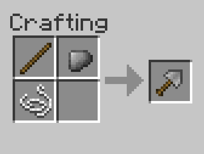

# Crimson's Tools

Some extra tools and small add-ons that I wanted to have and share! Intended to be ~relatively balanced for Standard
difficulty BTW, though of course your experience may vary.

[Download](https://github.com/BTW-Community/Crimsons-Tools/releases/latest)

## Installation
**Fabric is required!**
- Install Fabric with Better Than Wolves according to these [installation instructions](https://www.sargunster.com/btwforum/viewtopic.php?t=10201)
- Download `crimsons-tools-x.x.x.jar` and place it into the mods folder (Loader Mods in MultiMC)
- Enjoy! :)

## Information

### Stone Trowel

The Stone Trowel is meant to smooth the early-game base building gameplay, especially where deep dirt may be hard to find.
It allow you to dig out dirt and grass without converting adjacent dirt into "loose dirt" -- in short, allowing you to
tunnel without causing cave-ins. The trowel has very low durability and slow use speed. Along with the cost of string,
this maintains the Iron Shovel as a significant upgrade.